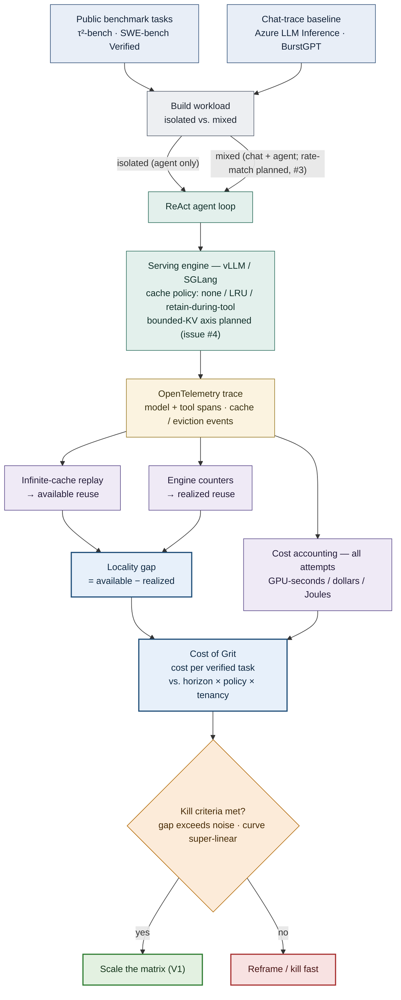

# GRIT — GPU Reuse under Interleaved Traffic

> *When chat and agents share one serving engine, how much of an agent's cache reuse actually survives — and what does the lost reuse cost per task the agent completes?*

**GRIT** (*GPU Reuse under Interleaved Traffic*) is a measurement-and-characterization study of
**agentic inference serving**. We quantify the
**realized-vs-available cache-locality gap** under realistic mixed (chat × agent) traffic and express
it as the **"Cost of Grit"** — cost per *verified task* ([`docs/metric-design.md`](docs/metric-design.md)) —
using only **public benchmarks** (SWE-bench Verified, τ²-bench) and **open infrastructure** (vLLM / SGLang).

Not a new system, recipe, or kernel — a rigorous, reproducible **measurement**.

- **Target:** MLSys 2027 Industry Track (~Oct 2026) — *provisional, pending CFP* ([`07-venues/venues.md`](07-venues/venues.md))
- **Status:** citation ledger complete · pilot design in review (open design issues gate GPU spend) · next step is the co-design / metric-redesign meeting, then the pilot cell
- **Start here:** [`STATUS.md`](STATUS.md) — the single source of "where are we"
- **New to the area?** [`docs/agentic-inference-brief.pdf`](docs/agentic-inference-brief.pdf) — an annotated study brief that summarizes every key paper in plain language (jargon explained, no shorthand)

---

## The problem

A chat request is one prompt → one stream; its KV cache (the stored attention state that lets the model
skip recomputing history) lives for a single turn. An **agent is a stateful loop** — model → tool →
model → … for tens to ~200 steps — so its context grows monotonically, the model is re-entered many
times against a mostly-shared prefix, the GPU idles during tool calls, and KV state becomes long-lived.
Prefix caching *should* make each re-entry nearly free — **if the cached prefix survives to the next step.**

Whether it does is genuinely contested in the 2026 literature, and the disagreement is the opening:

- **Agentic AI Workload Characteristics** (UIUC/Intel, 2605.26297) profiles real agents and finds the
  *available* reuse is very high (decode-dominated, with a read→write phase structure) — caching should win big.
- **Sutradhara** (Microsoft Research, 2601.12967) finds hit rates *collapse* in practice — but it runs
  **synthetic** requests at scale and attributes the collapse to intra-request churn + eviction, **not**
  to multiple workloads sharing the engine.

A high-reuse pole and a collapse pole that don't meet — because **no one has isolated the multi-tenant
driver on open infrastructure** (others now *co-locate* chat+agent to **schedule** it — e.g. Tempo,
2504.20068 — but none **measure** the locality tax that interleaving causes). The mechanistic root cause is the **orchestrator↔engine seam**: the
engine is *workflow-agnostic* (Cortex's term) — it sees a flat stream of independent requests, blind to
the agent loop, the imminent tool pause, and cross-request prefix sharing. The 2026 frontier is a
scramble to break that seam, split between **declaring** the contract via hints/plans/DAGs (Dynamo
`agent_hints`, KVFlow, Helium, HexAGenT, Cortex, Autellix) and **inferring** it engine-side
(Continuum/CacheTTL's TTL, GoodServe's prompt-inference). That mechanism space is **crowded and
well-funded** — which is exactly why we don't add another mechanism.

**What's still unmeasured — our exact target.** Under realistic *mixed* chat×agent traffic on a
*bounded* open-infra cache: (1) how far *realized* reuse falls below *available* reuse (the **locality
gap**); (2) how much of that drop is caused by **interleaving** vs. the agent's own context churn; and
(3) what the gap costs **per verified task the agent completes** (the *Cost of Grit*). The adjacent work
each misses a piece: **AA-AgentPerf** measures agents-per-megawatt on a *closed* set (capacity, not
cost-per-success); **Don't Break the Cache** measures at the provider-API black box (not open-infra
internals); **GoodServe** *optimizes* goodput but doesn't tie it to cost or release a trace. The closest 2026 work
tightens the screws further — **KVCache-in-the-Wild** (ATC'25) measures the locality gap but on a
*closed* stack with no agent/cost angle; **SAGA** quantifies the agent reuse gap on vLLM but agent-only,
no cost; **vLLM × Mooncake** released a public but *agent-only, un-cost-labeled* 610-trace corpus. The
empty intersection — open infra + mixed traffic + interleaving isolated + cost tied to verified work,
shipped as a public trace — is still ours.

## Contributions

| | Contribution | Status |
|---|---|---|
| **C1** — *lead* | The realized-vs-available **cache-locality gap** quantified on open infra, expressed as the **"Cost of Grit"** (cost per *verified task*); the *identifying primitive* is the **same-stream oracle-vs-bounded Δ GPU-seconds / verified task** ([`docs/metric-design.md`](docs/metric-design.md)) — gates C1 | pilot pending |
| **C3** — *artifact* | A released **mixed chat×agent, cost-labeled, OpenTelemetry-format serving trace + collection harness** — no public *mixed, cost-labeled, open-infra* agentic trace exists (closest prior: vLLM×Mooncake's agent-only, un-cost-labeled corpus) | bundled with C1 |

**C1, technically.** Hold the model fixed (Qwen2.5-Coder-32B — the model-vs-system confound control) and
vary the *serving* knobs: **horizon** (max agent iterations) × **cache policy** {none, LRU,
retain-during-tool} × **tenancy** {isolated, mixed}, on both vLLM and SGLang — plus a **bounded-KV
budget** (the knob that makes eviction bite) and a **rate-matched** mixed arm (the control that isolates
interleaving from raw offered load), both of which are *planned additions the current scaffold lacks*
(open issues #4 and #3). Two quantities:
- **Locality gap** = *available* reuse (offline, infinite-cache replay) − *realized* reuse (online,
  bounded-cache engine counters), on a common eligible-token denominator, in [0,1].
- **Cost of Grit** = total cost over *all attempts* (failures included) ÷ verified tasks — in
  **GPU-seconds** (primary), dollars, and Joules — reported as a **curve over horizon** and **at matched
  success rate** so serving never gets credit for model capability. Decomposed `cost/iter × iters/task ÷
  success-rate`, with the `cost/iter` term attributed to the locality gap.

**C3, the target schema.** OpenTelemetry-style spans (per model call and per tool call) rolled into a
per-task record. To make the offline replay *computable* and the interleaving effect attributable, the
schema **must** carry token/prefix identity, cache-hit/eviction events, tenant provenance, and an
attempt/retry structure with cost labels — **most of which the current scaffold does not yet record**
(open issues #2 and #8; today it stores token *counts* and a single per-task cost). Plus pinned
tokenizer/engine versions. Trace to be released CC-BY, harness Apache-2.0/MIT, targeting
artifact-evaluation badging.

Secondary / parked / pre-empted candidates — **C2** (cache-aware context-edit policy), **C4** (hint
interface — *pre-empted* by Dynamo's `agent_hints`), **C6** (harness-conditional benchmarking) — are in
[`04-ideas/candidates.md`](04-ideas/candidates.md); killed ideas with cause-of-death in
[`04-ideas/graveyard.md`](04-ideas/graveyard.md). **Discipline: measurement, not mechanism** — the
eviction/TTL/sharing/scheduling space is crowded; defensibility is the *bundle* (rigor + breadth + open
reproducibility + the trace + precise framing), not any single number.

> **Honesty markers.** Pilot is pre-data; the metric/trace contract is under active redesign (**the
> open design issues gate GPU spend** — [`05-experiments/pilot/README.md`](05-experiments/pilot/README.md)).
> The headline denominator (cost per verified *task*, with cost-per-*iteration* as the diagnostic) is the
> *proposed* decision in [`docs/metric-design.md`](docs/metric-design.md), **pending co-author
> ratification** — STATUS.md, the pilot README, `candidates.md`, and the harness still use the
> cost-per-*iteration* form. Industry numbers (Dynamo, AA-AgentPerf) are motivation, never cited as evidence.

## Hypotheses

Each is falsifiable with a stated kill criterion (full design in
[`05-experiments/pilot/README.md`](05-experiments/pilot/README.md)):

- **H1** — the locality gap is real on open infra, and multi-tenant **interleaving** is a *distinct* driver (separable from intra-agent churn).
- **H2** — the Cost of Grit (cost per verified task) grows **super-linearly** with horizon and is cache-policy-sensitive.
- **H3** — tool-gap timing has exploitable **phase structure** that static eviction gets wrong.
- **H4** — a small public **trace + harness reproduces H1–H2** (artifact-as-contribution).

## The pilot — first, cheap, kill-fast

```
ReAct × {τ²-bench, SWE-bench Verified} × {isolated, mixed} × {LRU, retain-during-tool} × 50 × 3
≈ 1,200 trajectories on one vLLM config  (~1–2 weeks, ~$500–600)
```

τ²-bench is the cheap **tool-gap (H3) probe**; **SWE-bench Verified is the long-horizon arm where the
locality tax should actually be visible** — a τ²-only pilot risks a *false-negative* kill of H1 (its
trajectories are short enough to fit a bounded cache). Readouts: available vs realized hit rate
(**the gap**), the Cost of Grit (cost per verified task), tool-gap distribution. The metric contract and the open design issues to settle before spending GPU budget are
in [`05-experiments/pilot/README.md`](05-experiments/pilot/README.md).

---

## Methodology (at a glance)

A deliberately small, kill-fast pilot that de-risks the lead measurement before any cross-product spend.
The five stages, and the design choice that makes each one *valid*:

1. **Workload** — agent tasks from a public benchmark, optionally interleaved with a chat trace. The
   mixed arm **must be rate-matched** (identical agent trajectories; chat as controlled background) so
   the contrast isolates *tenancy/interleaving* from raw offered load — the current count-based merge
   does *not* yet do this (open issue #3, the H1 confound).
2. **Serve** — run the ReAct loop on vLLM/SGLang under a cache policy ∈ {none, LRU, retain-during-tool}
   and a **bounded KV budget** so eviction actually bites (the budget is a *planned* first-class axis —
   open issue #4; the scaffold currently leaves it unset).
3. **Trace** — emit OpenTelemetry-style spans (per model + tool call) with cache/eviction events and
   attempt structure — enough to make the offline replay *computable*.
4. **Recover the quantities** — *available* reuse from an offline infinite-cache replay; *realized*
   reuse from engine counters ⇒ the **locality gap**; cost across **all attempts** (GPU-s/$/J) ⇒ the
   **Cost of Grit** curve over horizon × policy × tenancy.
5. **Gate** — apply kill criteria (is the gap above noise? is the curve super-linear?) *before* scaling.

Metric definition: [`docs/metric-design.md`](docs/metric-design.md). The open design issues that
gate GPU spend: [`05-experiments/pilot/README.md`](05-experiments/pilot/README.md).



**Reading the diagram.** Colour encodes *role* — blue = inputs, gray = workload build, green = online
serving (on the GPU), amber = the recorded trace, purple = offline measurement, navy = the two headline
results, orange = the decision gate, green/red = outcomes. The flow, in one breath: the two **inputs**
(an agent benchmark + a chat trace) are combined into a **workload** (run *isolated* or *mixed*); the
**agent loop** executes on the **serving engine** under a cache policy; every model/tool call is recorded
in one **trace**; offline we derive the two quantities that matter — the **locality gap** (compare an
infinite-cache *replay* against the engine's *realized* hit counters) and the **Cost of Grit** (total
cost over all attempts ÷ verified tasks) — and a **kill gate** decides scale-up vs. reframe.

> Note: the harness is a scaffold and the metric/trace contract is under redesign (the open design
> issues gate GPU spend) — the diagram is the *intended* pipeline, not a finished system.

## Repository layout

```
STATUS.md                                ← current state, read first
CHANGELOG.md                             Change & rollback log (decisions, keyed to commits)
docs/
  overview.md                            One-page reference: what / landscape / gap / problem / approach / limits
  agentic-inference-brief.pdf / .html    Annotated study brief — every paper summarized (start here to learn the area)
  agentic-inference-primer.md            Serving mental model + the agentic frontier
  inference-systems-reading-map.md       Canonical inference-systems papers (verified arXiv IDs)
  threats-to-validity.md                 Reviewer-defense checklist + methods/artifact commitments
  metric-design.md                       The "Cost of Grit" metric decision (cost-per-verified-task)
  observability-and-power.md             How the cache-visibility + statistical-power blockers get solved
  discovery-and-gaps.md                  Agents in the wild: harness/dev needs, benchmark↔production gap, public traces, who to talk to
  ecosystem-and-product-map.md           Product/business lens — ecosystem, personas, journeys, opportunities
  ecosystem-map.html                     Academic "Figure 1" interactive ecosystem map (open in a browser)
02-literature/
  sota-verified-2026.md                  Citation ledger — source of truth (✓ / ⚠)
  reading-queue.md                       Prioritized reading
  agentic-inference-survey.md            Survey            (placeholder)
  lit-review-short.md                    Condensed review  (placeholder)
  related-work-draft.md                  Related work      (placeholder)
04-ideas/
  candidates.md                          C1–C6 candidates (C1 "Cost of Grit" leads)
  graveyard.md                           Killed ideas — read before proposing new ones
05-experiments/pilot/
  README.md                              Pilot design + metric contract + open design issues
  experiments/matrix.yaml                Experiment matrix + the de-risking pilot cell
  harness/trace_schema.py                Metric contract (runs; smoke-tested)
  harness/run_pilot.py                   Orchestration skeleton (ownership seams)
06-collab/stakeholders.md                Co-authors + alignment
07-venues/venues.md                      Venue tracking
```

## Quick start

```bash
cd 05-experiments/pilot && python3 harness/trace_schema.py   # prints the derived metrics on a sample record
```
